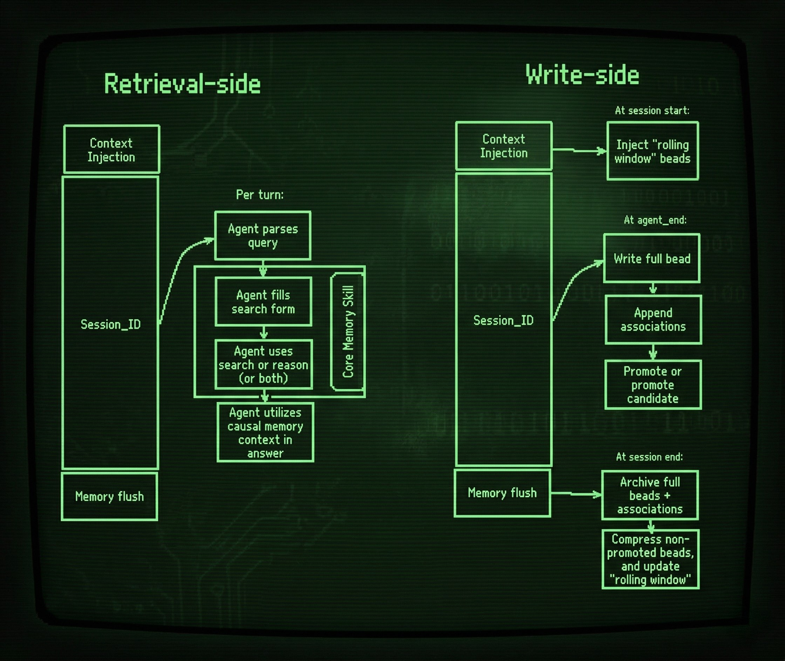

<p align="center">
 
</p>

<p align="center">
 <a href="LICENSE"></a>
 <a href="#"></a>
</p>

<p align="center">
 <b>Causal memory for AI agents.</b><br>
 Structured memory objects + causal trace over durable events — so agents can recall <i>why</i>, not just <i>what</i>.
</p>

<p align="center">
 <a href="#install">Install</a> ·
 <a href="#fastest-paths">Fastest Paths</a> ·
 <a href="#service-mode-springai--http">Service Mode</a> ·
 <a href="#current-status">Current Status</a> ·
 <a href="docs/architecture_overview.md">Architecture</a> ·
 <a href="docs/public_surface.md">Public Surface</a> ·
 <a href="#contributing">Contributing</a>
</p>

---

## Reviewer Quick Path

- [docs/reviewers/start-here.md](docs/reviewers/start-here.md)
- [docs/concepts/why-core-memory.md](docs/concepts/why-core-memory.md)
- [docs/architecture_overview.md](docs/architecture_overview.md)
- [docs/canonical_surfaces.md](docs/canonical_surfaces.md)
- [docs/integrations/](docs/integrations/) (OpenClaw / PydanticAI / SpringAI / LangChain)

## Current Status

- **Canonical surfaces:** finalized-turn ingest + `search` / `trace` / `execute`
- **Compatibility surfaces:** archived or non-primary docs/modules retained for migration/history only
- **Experimental areas:** optional adapters and evaluation harnesses that are useful but not yet hard product contract
- **Not yet integrated:** ideas/proposals not represented in canonical docs or adapter references are intentionally out of current contract scope

---

## Live Demo

<p align="center">
 <a href="https://youtu.be/56uyTJEnOAA">
 
 </a>
</p>

[Watch the Core Memory live demo on YouTube](https://youtu.be/56uyTJEnOAA)

---

## What Is Core Memory?

Most agent memory systems store *what happened*. Core Memory stores **why it happened**.

It records structured memory events called **beads** — decisions, lessons, outcomes, evidence, context — and the causal links between them. When an agent asks “why did we change strategy?”, Core Memory retrieves a decision chain, not just keyword matches.

### Why use it?

| Approach | Failure Mode | Core Memory |
|---|---|---|
| Chat log replay | Context window explodes | Bounded rolling window with compaction |
| Vector similarity | “Similar” ≠ “relevant” | Semantic-first anchors + causal trace over explicit bead links |
| Tool call logs | No reasoning structure | Explicit bead → bead associations |

**Core local write flow has zero required runtime dependencies beyond Python.**
Query-based anchor lookup in canonical mode requires semantic backend support (or explicit degraded mode opt-in).
Optional extras exist for HTTP service mode and integration-specific workflows.

---

## Install

### From PyPI

```bash
pip install core-memory
```

### From source

```bash
git clone https://github.com/JohnnyFiv3r/Core-Memory.git
cd Core-Memory
python3 -m venv .venv
source .venv/bin/activate
pip install -U pip
pip install -e .
```

### Optional extras

Semantic backend extras (recommended for canonical query path):

```bash
pip install "core-memory[semantic]"
```

HTTP companion service:

```bash
pip install "core-memory[http]"
```

PydanticAI adapter:

```bash
pip install "core-memory[pydanticai]"
```

Developer/test extras:

```bash
pip install "core-memory[dev]"
```

---

## Fastest Paths

### 1) Local CLI path

This is the fastest “I want to see it work” flow.

```bash
core-memory --root ./memory setup init
core-memory --root ./memory setup doctor
core-memory --root ./memory graph semantic-doctor
core-memory --root ./memory store add \
 --type decision \
 --title "Redis fix" \
 --summary "Raised pool size" \
 --session-id s1 \
 --source-turn-ids t1
# Option A (recommended): semantic backend installed via core-memory[semantic]
# Option B (degraded mode):
#   export CORE_MEMORY_CANONICAL_SEMANTIC_MODE=degraded_allowed
core-memory --root ./memory memory search --query "Redis fix"
```

Expected result: the recall command should surface the bead you just wrote.

### 2) Python embed path

This is the simplest in-process usage.

```python
from core_memory import MemoryStore

store = MemoryStore("./memory")

store.add_bead(
 type="decision",
 title="Redis fix",
 summary=["Raised pool size"],
 session_id="s1",
 source_turn_ids=["t1"],
)

for bead in store.query(limit=5):
 print(f"[{bead['type']}] {bead['title']}")
```

### 3) Write and recall a causal chain

```python
from core_memory import MemoryStore, BeadType

store = MemoryStore("./memory")

store.add_bead(
 type=BeadType.LESSON,
 title="Redis timeouts under high load",
 summary=["Worker count exceeded connection pool limit"],
)

store.add_bead(
 type=BeadType.DECISION,
 title="Increased Redis max connections to 200",
 summary=["Pool exhaustion was root cause", "Resolved P1 incident"],
)

packet = store.query(limit=5)
for bead in packet:
 print(f"[{bead['type']}] {bead['title']}")
```

```text
[lesson] Redis timeouts under high load
[decision] Increased Redis max connections to 200
```

---

## Service Mode (SpringAI / HTTP)

For JVM, JS/TS-adjacent, or service-oriented architectures, run Core Memory as a companion HTTP service.

### Start the service

```bash
python3 -m venv .venv
source .venv/bin/activate
pip install -U pip
pip install -e ".[http]"
python3 -m uvicorn core_memory.integrations.http.server:app --host 0.0.0.0 --port 8000
```

Optional auth:

```bash
export CORE_MEMORY_HTTP_TOKEN="change-me"
```

### Verify the service

```bash
curl http://localhost:8000/healthz
```

```bash
curl -X POST http://localhost:8000/v1/memory/execute \
 -H "Content-Type: application/json" \
 -d '{
 "request": {
 "raw_query": "why did we change strategy?",
 "intent": "causal",
 "k": 5
 },
 "explain": true
 }'
```

### SpringAI write path

Send finalized assistant turns to:

- `POST /v1/memory/turn-finalized`

Minimum useful fields:

- `session_id`
- `turn_id`
- `user_query`
- `assistant_final`

Session lifecycle boundaries:

- `POST /v1/memory/session-start` (explicit session-start snapshot boundary)
- `POST /v1/memory/session-flush` (session-end flush boundary)
- `GET /v1/memory/continuity` (pure-read continuity payload; no implicit writes)

### SpringAI runtime path

Preferred single-call endpoint:

- `POST /v1/memory/execute`

This is the best fit for service-oriented orchestration where a backend needs one deterministic memory call instead of multiple client-side routing steps.

See also:

- [docs/integrations/springai/quickstart.md](docs/integrations/springai/quickstart.md)
- [docs/integrations/springai/integration-guide.md](docs/integrations/springai/integration-guide.md)
- [docs/integrations/springai/api-reference.md](docs/integrations/springai/api-reference.md)

---

## Integrations

### Canonical ingress port

```python
from core_memory.integrations.api import emit_turn_finalized
```

### Available integration surfaces

- OpenClaw bridge
- PydanticAI native adapter
- SpringAI / HTTP companion service
- LangChain (`CoreMemory`, `CoreMemoryRetriever`)
- LangChain (`CoreMemory` + `CoreMemoryRetriever`)

### Good starting points

- [examples/quickstart.py](examples/quickstart.py)
- [examples/pydanticai_basic.py](examples/pydanticai_basic.py)
- [docs/integrations/springai/quickstart.md](docs/integrations/springai/quickstart.md)
- [docs/integrations/langchain/quickstart.md](docs/integrations/langchain/quickstart.md)

---

## How It Works

<p align="center">
 
</p>

Core Memory separates **retrieval** from **writes**, connected through session-scoped bead storage. Each agent turn follows the same loop:

1. **Inject** — build a bounded context packet
2. **Execute** — run the agent turn
3. **Extract** — capture structured events as beads
4. **Store** — append to durable session/event surfaces
5. **Compact** — preserve important causal memory, compress the rest
6. **Recall** — retrieve causal chains when the agent needs them

---

## Core Concepts

### Beads

A bead is a structured memory event: decision, lesson, outcome, evidence, context, or another typed unit of recall.

### Associations

Associations are explicit links between beads and remain queryable even as memory compacts.

### Retrieval Pipeline

Canonical retrieval surfaces:
- `search` (anchor retrieval)
- `trace` (causal traversal)
- `execute` (single orchestration entrypoint)

Semantic mode behavior:
- `CORE_MEMORY_CANONICAL_SEMANTIC_MODE=required` (default) fails closed for query-based anchor lookup when semantic backend is unavailable.
- `CORE_MEMORY_CANONICAL_SEMANTIC_MODE=degraded_allowed` allows explicit degraded lexical fallback with markers.

Hydration is explicit post-selection source recovery (turn/tools/adjacent), not a general retrieval mode.

Deep recall exists as a separate capability and is not the same thing as canonical hydration.

Retrieval is deterministic from indexed state.

---

## Repo Map

```text
core_memory/
├── persistence/
├── schema/
├── retrieval/
├── graph/
├── write_pipeline/
├── runtime/
├── association/
├── integrations/
├── policy/
└── cli.py
```

Other useful folders:

- `examples/` runnable examples
- `tests/` behavioral and regression coverage
- `docs/` architecture, integration guides, and contracts
- `plugins/` OpenClaw bridge assets
- `demo/` live demo app and assets

---

## Contributing

```bash
git clone https://github.com/JohnnyFiv3r/Core-Memory.git
cd Core-Memory
python3 -m venv .venv
source .venv/bin/activate
pip install -U pip
pip install -e ".[dev]"
core-memory --help
python3 -c "import core_memory; print('core_memory import ok')"
pytest
```

Useful docs:

- [CONTRIBUTING.md](CONTRIBUTING.md)
- [docs/public_surface.md](docs/public_surface.md)
- [docs/index.md](docs/index.md)

---

## Inspiration

Inspired in part by Steve Yegge’s writing on beads and memory systems:
https://github.com/steveyegge/beads

---

<p align="center">
 <a href="LICENSE">Apache-2.0 License</a> ·
 <a href="CODE_OF_CONDUCT.md">Code of Conduct</a> ·
 <a href="CHANGELOG.md">Changelog</a>
</p>
