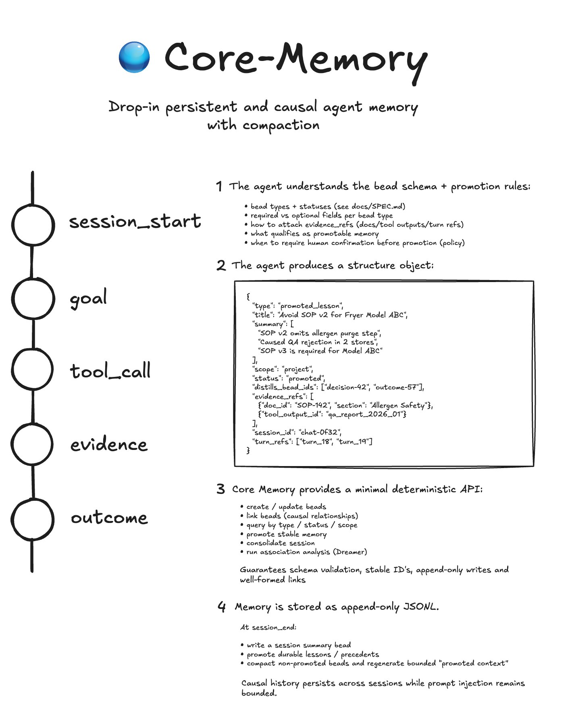

# Core Memory

A deterministic, causal memory system for AI agents: **“beads for memory.”**

Core Memory stores durable **beads** (decisions, lessons, outcomes, evidence, etc.) and explicit links between them, then compacts and injects the most relevant prior memory into the agent context via a **Context Packet**.



---

## Why

Most "agent memory" is either:
- raw chat logs (bloats context, low signal), or
- vector similarity recall (non-deterministic, hard to debug)

Core Memory is different:
- explicit causal structure (graph of beads + links)
- lossless storage + lossy injection (compaction tiers)
- debuggable and reproducible (store-backed, deterministic assembly)

---

## Concepts

### Beads
A bead is a small, structured memory unit:
- type: `decision`, `lesson`, `outcome`, `goal`, `evidence`, ...
- title + summary bullets
- tags/scope/session metadata
- lifecycle state (`open` / `promoted` / `compacted` / `superseded` / `tombstoned`)

### Links (Edges)
Links connect beads explicitly (e.g. `derives-from`, `supersedes`, `validates`).

#### Edge authority
- `edge_class="authored"`: written by the agent/model (canonical causal truth)
- `edge_class="derived"`: inferred by crawlers/associators (optional, pruneable)

### Sessions
Beads are grouped into sessions. Core Memory maintains a session index to support rolling-window selection and compaction.

### Compaction tiers
Compaction is render-layer only (store remains lossless):
- full (new/recent)
- summary (older)
- minimal (anchors)
- tombstoned (not injected; still traversable for audit)

### Context Packet
Each turn, Core Memory produces a Context Packet: an ordered, token-budgeted set of compacted bead renders drawn from the last N sessions and relevant causal chains.

---

## Install

```bash
python3 -m venv .venv
.venv/bin/python -m pip install -e .
```

Configure store root:

```bash
export CORE_MEMORY_ROOT="$PWD/memory"
```

---

## Quickstart

Create a bead:

```bash
core-memory --root "$CORE_MEMORY_ROOT" add --type decision --title "Use stdlib only" --session-id main --tags core-memory
```

Query beads:

```bash
core-memory --root "$CORE_MEMORY_ROOT" query --type decision --limit 5
```

Compaction + restore:

```bash
core-memory --root "$CORE_MEMORY_ROOT" compact --session main --promote
core-memory --root "$CORE_MEMORY_ROOT" uncompact --id <bead_id>
```

Migrate legacy store:

```bash
core-memory --root "$CORE_MEMORY_ROOT" migrate-store --legacy-root /path/to/legacy/.mem-beads
```

---

## Environment

- Primary: `CORE_MEMORY_ROOT` (recommended)
- Compatibility accepted by migration tooling: `MEMBEADS_ROOT`, `MEMBEADS_DIR`
- CLI default root when unset: `./memory`

## Platform note

Current file-locking uses POSIX `fcntl`, so write-lock behavior is POSIX-first (Linux/macOS/WSL).
For native Windows support, a lock fallback implementation is still needed.

## Store layout

```text
<root>/
  .beads/
    index.json
    global.jsonl
    session-<id>.jsonl
    archive.jsonl
    .lock
    events/
      global.jsonl
      session-<id>.jsonl
  .turns/
    session-<id>.jsonl
```

---

## CLI reference (most-used)

- `core-memory add ...` — create bead
- `core-memory query ...` — inspect memory state
- `core-memory compact ...` — compact bead detail (lossless via archive)
- `core-memory uncompact ...` — restore compacted detail
- `core-memory myelinate ...` — deterministic myelination pass output
- `core-memory migrate-store ...` — import legacy mem_beads stores

---

## How context injection works

1. Read beads + authored edges from store
2. Select relevant sessions/chains under token budget
3. Apply compaction tiers (render-only)
4. Emit deterministic Context Packet

Given the same store + config, packet assembly is deterministic.

---

## Myelination (optional)

Myelination operates on **derived** edges only.
It can reinforce frequently useful derived links and prune weak/noisy ones without mutating authored causal truth.

---

## Contributing

### Design invariants (do not break)
- Lossless storage: compaction is render-layer only
- Authored edges are immutable truth
- Derived edges are pruneable
- Context Packet must be deterministic for same store + config
- Links persist through compaction

Run tests:

```bash
pytest -q
```

---

## Roadmap

- Graph DB backend (optional)
- Edge myelination (derived edges only)
- Session digest bead
- Better token estimation based on render formats
- Pluggable retrieval strategies

---

## Compatibility note

- `core-memory` is canonical.
- Legacy `mem_beads` runtime code and `mem-beads` command alias have been removed.
- Use `core-memory migrate-store` to import older `.mem-beads` stores.

## License

MIT
