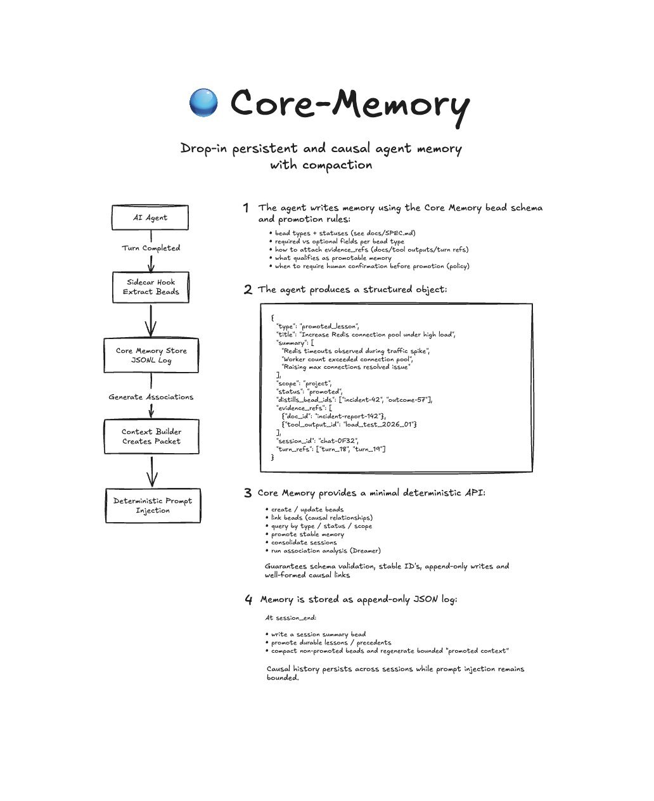

# Core Memory

Core Memory is a deterministic memory layer for agents. It stores structured memory events ("beads") and explicit links so recall stays inspectable and repeatable across context resets.



---

## Why Core Memory Exists

Most memory approaches fail for different reasons:

| Approach | Problem |
|---|---|
| Chat log replay | Context grows uncontrollably |
| Vector memory | Non-deterministic recall |
| Tool logs | No causal reasoning |

Core Memory stores explicit causal memory events (**beads**) and relationships so retrieval is deterministic and debuggable.

Typical bead types include:
- `lesson`
- `decision`
- `outcome`
- `hypothesis`
- `association`

---

## Quick Example

```python
from core_memory import MemoryStore

memory = MemoryStore("./memory")
memory.add_bead(type="lesson", title="Redis timeouts under high load", summary=["Worker count exceeded Redis connection pool"])
memory.add_bead(type="outcome", title="Increased Redis connection pool", summary=["Raising max connections resolved timeouts"])

packet = memory.query(limit=5)
print("Relevant Memory")
for bead in packet:
    print(f"- [{bead['type']}] {bead['title']}")
```

Example output:

```text
Relevant Memory
- [lesson] Redis timeouts under high load
- [outcome] Increased Redis connection pool
```

---

## Core Concepts

### Bead
A bead is a structured memory event.

Example:
```text
Type: lesson
Title: Redis pool exhaustion
Summary: Worker count exceeded connection pool limit
```

### Association
An association links beads with explicit causality or relationship.

Example:
```text
lesson -> outcome
Redis pool exhaustion -> Increased Redis connection pool
```

### Context Packet
A context packet is the bounded set of recalled beads prepared for prompt injection.

Example:
```text
Relevant Memory
- Redis pool exhaustion caused timeouts previously
- Increasing max connections resolved the issue
```

### Compaction
Compaction preserves durable history while shrinking prompt-facing detail.

Example:
```text
Before: full incident narrative + logs
After: compact summary + causal links retained
```

Core Memory operates over the lifecycle of an agent session.

### Session Lifecycle
Rather than treating memory as a static retrieval system, the store evolves as the agent interacts with the environment.

A session follows a simple loop:
- Inject a bounded memory window into the prompt
- Execute an agent turn
- Extract memory events ("beads")
- Append events to the memory log
- Run compaction and promotion
- Build the next memory window

This loop repeats for every turn in the session.

#### Session Start
When a session begins, Core Memory constructs an initial context packet from the memory store. The packet is bounded to a fixed token budget (typically ~10k tokens).

This packet contains:
- recently relevant beads
- promoted long-term memory
- causal associations between related events

This packet is injected into the system prompt before the first agent turn.

#### During a Turn
While the agent interacts with the user or tools, Core Memory captures structured events from the interaction. These events are recorded as beads, which represent meaningful memory units such as:
- lessons learned
- decisions made
- outcomes of actions
- hypotheses or observations

The sidecar hook extracts these events at the end of the turn and appends them to the memory log. Memory storage is append-only, meaning the full history of events is preserved.

#### Compaction
After each turn, Core Memory runs a compaction step. Compaction ensures the context packet remains bounded while preserving important knowledge.

Peripheral or low-signal beads gradually degrade to a minimal representation containing:
- bead type
- title
- causal associations

This allows the system to retain structural knowledge while reducing token usage. Important beads remain intact.

#### Promotion
Some beads become promoted memory. Promotion indicates that a memory event is considered load-bearing context for future reasoning.

Promoted beads are preserved with full detail during compaction and remain visible in future context packets. Promotion decisions are typically made by the agent itself based on system prompt instructions.

For example, an agent may promote:
- important lessons
- stable system behavior
- resolved incidents
- persistent constraints

Promotion allows Core Memory to distinguish between:
- transient conversational context
- durable knowledge

#### Bead Query Tool
In addition to automatic recall through context packets, agents can directly query the memory store. The bead query tool allows the agent to retrieve specific memory events based on:
- bead type
- status (promoted, archived, etc.)
- scope (session, project, global)

This enables explicit reasoning over prior events.

For example, an agent may query:
- retrieve promoted lessons about database failures
- retrieve recent outcomes related to deployment incidents

The tool returns structured bead data that the agent can use for reasoning, planning, or explanation. This mechanism complements automatic memory injection and provides a deterministic interface to long-term memory.

#### Memory Budget
Core Memory uses a bounded token budget for injected memory (typically ~10k tokens). This constraint ensures that prompt context remains predictable and stable regardless of how long the system runs.

As new beads are appended to the memory log:
- recent events enter the context window
- older events gradually compact
- promoted memory remains preserved

This creates a natural rolling memory window where important knowledge persists while low-signal context fades over time. No explicit TTL or expiration logic is required.

#### Why This Matters
Most agent memory systems rely on:
- raw conversation replay
- vector similarity retrieval

Both approaches make it difficult to reason about what knowledge persists over time.

Core Memory instead treats memory as a structured causal history. The system evolves as the agent interacts with the environment, preserving important knowledge while maintaining a bounded prompt context.

---

## Concepts and Behavior

- **Store is durable and lock-protected**.
- **Recall is deterministic** from indexed state.
- **Compaction is lossless to archive, lossy to prompt render**.
- **Causal links remain queryable for audit/debugging**.

---

## Install

```bash
python3 -m venv .venv
.venv/bin/python -m pip install -e .
```

Configure store root:

```bash
export CORE_MEMORY_ROOT="$PWD/memory"
```

---

## Integrations

Wave 1 adapters are thin wrappers over one stable port:

- `core_memory.integrations.api.emit_turn_finalized(...)`

Current integrations:
- OpenClaw
- PydanticAI
- SpringAI (HTTP ingress)

Privacy modes:
- `store_full_text=true`: store inline assistant text
- `store_full_text=false`: store `assistant_final_ref` + hashes

Retrieval model:
- Rolling window injection for bounded, always-on context
- Deep recall path (`retrieve-context`) can search full history and bounded-uncompact archived beads when memory intent is detected

---

## Roadmap

- Association inference
- Memory compaction strategies
- Graph-based storage backends
- Multi-agent shared memory
- Framework integrations (OpenClaw, PydanticAI, SpringAI)

Core Memory is intentionally early-stage and open to experimentation.

See also:
- [Graph retrieval architecture](docs/graph_memory.md)

---

## Contributing

See:
- [CONTRIBUTING.md](CONTRIBUTING.md)
- [CODE_OF_CONDUCT.md](CODE_OF_CONDUCT.md)
- [LICENSE](LICENSE)

---

## Inspiration

The concept of "beads" as small units of causal memory was inspired in part by Steve Yegge’s writing on software architecture and memory systems. This project explores a different application of that idea in the context of AI agents and deterministic prompt memory.

You can find his work at https://github.com/steveyegge/beads
