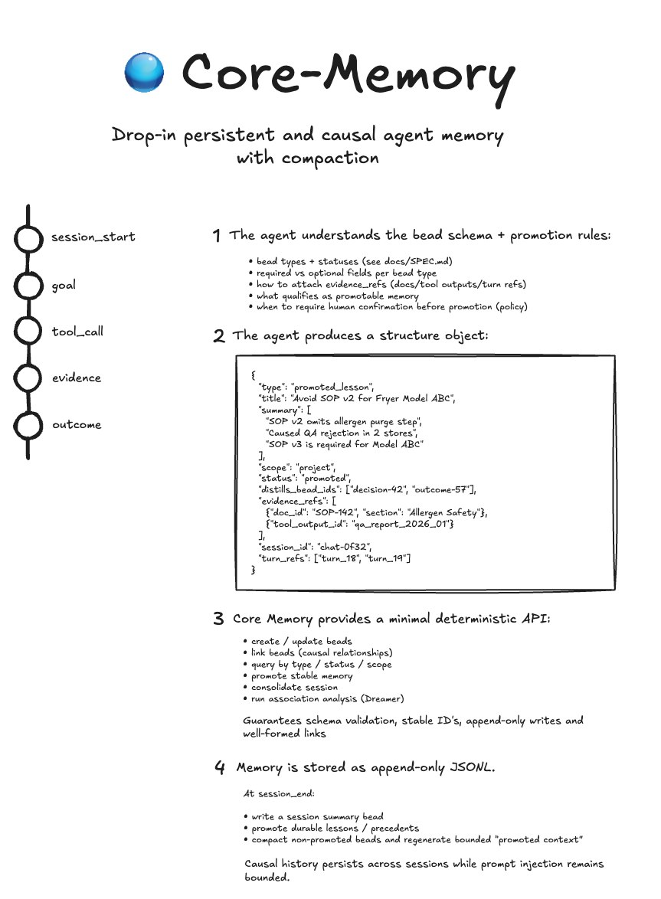

# Core Memory

Core Memory is a deterministic memory layer for agents. It stores structured memory events ("beads") and explicit links so recall stays inspectable and repeatable across context resets.



---

## Why Core Memory Exists

Most memory approaches fail for different reasons:

| Approach | Problem |
|---|---|
| Chat log replay | Context grows uncontrollably |
| Vector memory | Non-deterministic recall |
| Tool logs | No causal reasoning |

Core Memory stores explicit causal memory events (**beads**) and relationships so retrieval is deterministic and debuggable.

Typical bead types include:
- `lesson`
- `decision`
- `outcome`
- `hypothesis`
- `association`

---

## Quick Example

```python
from core_memory import MemoryStore

memory = MemoryStore("./memory")
memory.add_bead(type="lesson", title="Redis timeouts under high load", summary=["Worker count exceeded Redis connection pool"])
memory.add_bead(type="outcome", title="Increased Redis connection pool", summary=["Raising max connections resolved timeouts"])

packet = memory.query(limit=5)
print("Relevant Memory")
for bead in packet:
    print(f"- [{bead['type']}] {bead['title']}")
```

Example output:

```text
Relevant Memory
- [lesson] Redis timeouts under high load
- [outcome] Increased Redis connection pool
```

---

## Core Concepts

### Bead
A bead is a structured memory event.

Example:
```text
Type: lesson
Title: Redis pool exhaustion
Summary: Worker count exceeded connection pool limit
```

### Association
An association links beads with explicit causality or relationship.

Example:
```text
lesson -> outcome
Redis pool exhaustion -> Increased Redis connection pool
```

### Context Packet
A context packet is the bounded set of recalled beads prepared for prompt injection.

Example:
```text
Relevant Memory
- Redis pool exhaustion caused timeouts previously
- Increasing max connections resolved the issue
```

### Compaction
Compaction preserves durable history while shrinking prompt-facing detail.

Example:
```text
Before: full incident narrative + logs
After: compact summary + causal links retained
```

---

## Concepts and Behavior

- **Store is durable and lock-protected**.
- **Recall is deterministic** from indexed state.
- **Compaction is lossless to archive, lossy to prompt render**.
- **Causal links remain queryable for audit/debugging**.

---

## Install

```bash
python3 -m venv .venv
.venv/bin/python -m pip install -e .
```

Configure store root:

```bash
export CORE_MEMORY_ROOT="$PWD/memory"
```

---

## Integrations

Wave 1 adapters are thin wrappers over one stable port:

- `core_memory.integrations.api.emit_turn_finalized(...)`

Current integrations:
- OpenClaw
- PydanticAI
- SpringAI (HTTP ingress)

Privacy modes:
- `store_full_text=true`: store inline assistant text
- `store_full_text=false`: store `assistant_final_ref` + hashes

---

## Roadmap

- Association inference
- Memory compaction strategies
- Graph-based storage backends
- Multi-agent shared memory
- Framework integrations (OpenClaw, PydanticAI, SpringAI)

Core Memory is intentionally early-stage and open to experimentation.

---

## Contributing

See:
- [CONTRIBUTING.md](CONTRIBUTING.md)
- [CODE_OF_CONDUCT.md](CODE_OF_CONDUCT.md)
- [LICENSE](LICENSE)
