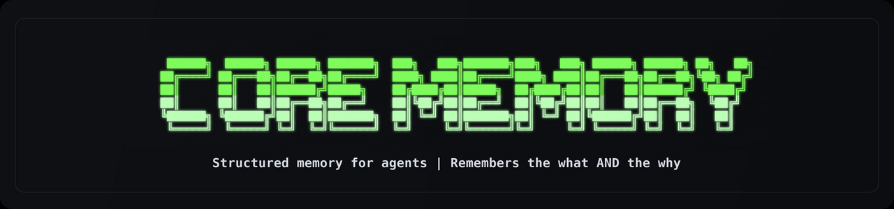

<p align="center">
  
</p>

<p align="center">
  
  
  
  
</p>

<p align="center">
  <a href="LICENSE"></a>
  <a href="#"></a>
</p>

<p align="center">
  <b>Causal memory for AI agents.</b><br>
  Structured event storage with deterministic, debuggable recall — so agents remember <i>why</i>, not just <i>what</i>.
</p>

<p align="center">
  <a href="#quick-start">Quick Start</a> · <a href="docs/architecture_overview.md">Architecture</a> · <a href="docs/public_surface.md">API Surface</a> · <a href="#contributing">Contributing</a>
</p>

---

## What is Core Memory?

Most agent memory systems store *what happened*. Core Memory stores **why it happened**.

It records structured memory events called **beads** — decisions, lessons, outcomes, evidence, context — and the causal links between them. When an agent asks "why did we change strategy?", Core Memory retrieves a decision chain, not just keyword matches.

**How it's different:**

| Approach | Failure Mode | Core Memory |
|---|---|---|
| Chat log replay | Context window explodes | Bounded rolling window with compaction |
| Vector similarity | "Similar" ≠ "relevant" | Typed causal edges + hybrid retrieval |
| Tool call logs | No reasoning structure | Explicit bead → bead associations |

**Zero required runtime dependencies for core local flow.** Pure Python. Optional extras exist for HTTP/dev workflows.

---

## Quick Start

Install from source:

```bash
git clone https://github.com/JohnnyFiv3r/Core-Memory.git
cd Core-Memory
pip install -e .
```

If/when published on PyPI, you can also install via:

```bash
pip install core-memory
```

### Write and recall a causal chain

```python
from core_memory import MemoryStore, BeadType

store = MemoryStore("./memory")

store.add_bead(
    type=BeadType.LESSON,
    title="Redis timeouts under high load",
    summary=["Worker count exceeded connection pool limit"],
)
store.add_bead(
    type=BeadType.DECISION,
    title="Increased Redis max connections to 200",
    summary=["Pool exhaustion was root cause", "Resolved P1 incident"],
)

packet = store.query(limit=5)
for bead in packet:
    print(f"  [{bead['type']}] {bead['title']}")
```

```text
  [lesson] Redis timeouts under high load
  [decision] Increased Redis max connections to 200
```

---

## How It Works

<p align="center">
  
</p>

Core Memory separates **retrieval** from **writes**, connected through session-scoped bead storage. Each agent turn follows the same loop:

1. **Inject** — bounded context packet is built from store
2. **Execute** — agent runs turn
3. **Extract** — structured events captured as beads
4. **Store** — append-only session log write
5. **Compact** — peripheral beads degrade to compact form, promoted beads preserved
6. **Repeat**

---

## Core Concepts

### Beads
A bead is a structured memory event — the atomic unit of recall.

### Associations
Associations are explicit links between beads and remain queryable as memory compacts.

### Retrieval Pipeline
Core Memory uses hybrid retrieval:
- field-weighted lexical search
- semantic retrieval (when available)
- score fusion
- structural rerank with causal traversal

Retrieval is deterministic from indexed state.

---

## Integrations

Canonical ingress port:

```python
from core_memory.integrations.api import emit_turn_finalized
```

Framework adapters:
- OpenClaw (bridge)
- PydanticAI (native adapter)
- SpringAI (HTTP ingress)

See [`examples/pydanticai_basic.py`](examples/pydanticai_basic.py).

---

## Repo Map

```
core_memory/
├── persistence/
├── schema/
├── retrieval/
├── graph/
├── write_pipeline/
├── runtime/
├── association/
├── integrations/
├── policy/
└── cli.py
```

- `examples/` runnable demos
- `tests/` behavioral + regression tests
- `docs/` architecture/contracts/specs
- `scripts/` setup + diagnostics

---

## Contributing

```bash
git clone https://github.com/JohnnyFiv3r/Core-Memory.git
cd Core-Memory
pip install -e ".[dev]"
pytest
```

- [CONTRIBUTING.md](CONTRIBUTING.md)
- [docs/public_surface.md](docs/public_surface.md)
- [docs/index.md](docs/index.md)

---

## Inspiration

Inspired in part by Steve Yegge’s writing on beads/memory systems:
https://github.com/steveyegge/beads

---

<p align="center">
  <a href="LICENSE">MIT License</a> · <a href="CODE_OF_CONDUCT.md">Code of Conduct</a> · <a href="CHANGELOG.md">Changelog</a>
</p>
