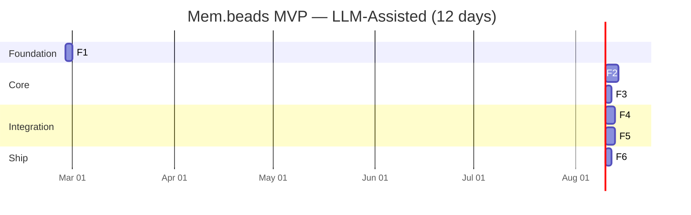
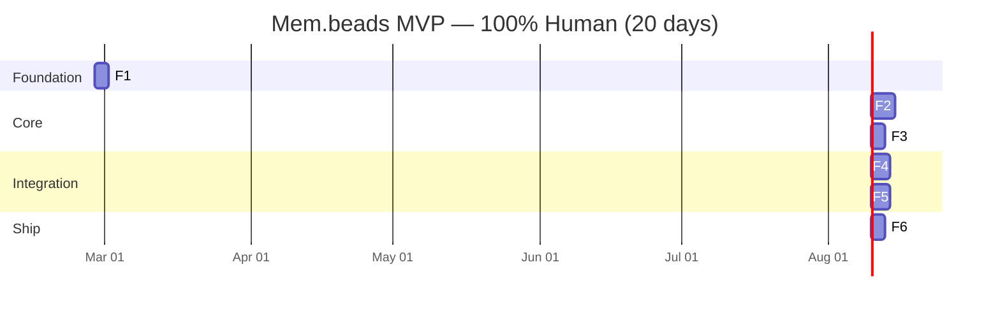
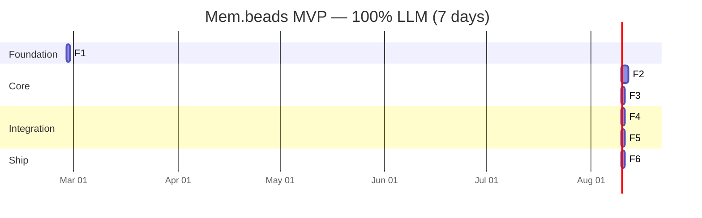

# Project Plan: Mem.beads
## Persistent Causal Agent Memory with Compaction

**Author**: Johnny Inniger + Krusty
**Date**: 2026-02-26
**Status**: Approved for implementation
**Target**: OpenClaw MVP (single agent, single user)

---

## Executive Summary

Mem.beads is a structured, append-only memory system for AI agents that preserves causal chains across sessions. Every agent turn becomes a typed bead on a causal chain. Beads are compacted (never deleted) to fit a 10k token rolling window injected at session start. Promoted beads persist longer and eventually graduate to long-term memory (MEMORY.md). The full archive is always recoverable via uncompaction.

The MVP targets this OpenClaw instance. Future phases extend to Line Lead (Spring AI), Delta Bravo (PydanticAI), association crawling, and myelination-based pruning.

## Plan Complexity

**Complexity**: Medium
**Rationale**: 6 features with clear dependencies. Well-understood stack (Python + JSONL + OpenClaw sub-agents). Novel design patterns (causal compaction, dynamic window injection) but no external infrastructure required. Primary risk is sub-agent prompt engineering for consistent bead quality.

## Time Estimates

**Time scale**: 1 day = 8 hours; 1 week = 40 hours (5 days). Assumes 1 developer.

| Estimate | Duration | Notes |
|----------|----------|-------|
| **100% human** | 18-22 days (4-4.5 weeks) | Schema design + Python scripts + prompt engineering + integration testing |
| **LLM-assisted** | 10-14 days (2-3 weeks) | LLM generates script scaffolding, schema, prompt drafts; human reviews + iterates |
| **100% LLM** | 6-8 days (1-1.5 weeks) | Agentic build with human review checkpoints at each feature |

LLM-assisted assumes ~40% time reduction. 100% LLM assumes sub-agent delegation for script writing with human approval gates.

## Defined Risks

| Risk | Likelihood | Impact | Mitigation |
|------|------------|--------|------------|
| Sub-agent bead quality inconsistent | High | High | Strict schema validation in write layer; iterate on prompt with real conversations; reject malformed beads |
| Per-turn sub-agent latency slows conversation | Medium | Medium | Fire-and-forget (don't block main agent on bead write); use fast model for per-turn |
| Rolling window token counting inaccurate | Medium | Low | Use tiktoken for accurate counts; add 10% buffer under 10k budget |
| JSONL corruption from concurrent writes | Low | High | Single-writer pattern (sub-agent is only writer); file locking in Python scripts |
| Compaction loses important context | Medium | Medium | Conservative flagging (over-promote rather than under-promote in v1); full archive always recoverable |
| Causal chain breaks across sessions | Low | High | Enforce session_start → prior session_end link in schema validation; fail loudly if chain breaks |

---

## Product Requirements

### Business Context
AI agents lose context across sessions. Current flat-file memory (MEMORY.md + daily notes) is unstructured, has no causal links, and can't be selectively compressed/expanded. Mem.beads introduces structured, typed, causally-linked memory that compacts losslessly.

### User Stories

**US-1**: As an agent, I write a structured bead for every turn so my actions are captured with causal links.
- Acceptance: Every turn produces a valid bead in the session JSONL. Each bead links to prior bead.

**US-2**: As an agent, I flag important beads for promotion so they persist longer in the rolling window.
- Acceptance: Flagged beads include written rationale. Non-flagged beads compact to type+id after session end.

**US-3**: As a user, my agent remembers context from prior sessions via the rolling window.
- Acceptance: Session start injects up to 10k tokens of recent + promoted beads. Agent can reference prior session context naturally.

**US-4**: As a user, I can ask my agent to recall detailed context from any past session.
- Acceptance: Agent uses uncompact tool to restore full bead detail from archive. Causal neighbors are included.

**US-5**: As a user, important lessons and decisions graduate to my long-term memory.
- Acceptance: Promoted beads that age out of rolling window are written to MEMORY.md.

**US-6**: As a user, I can override the agent's promotion decisions.
- Acceptance: "Remember this" promotes; "forget this" compacts. User authority is absolute.

### Non-Functional Requirements
- Per-turn bead write must not block main agent response (fire-and-forget sub-agent)
- Compaction script runs in <10 seconds for typical session (~50 beads)
- Rolling window generation runs in <5 seconds
- JSONL files must be human-readable (pretty-printable)
- System must work offline (no external APIs for memory management itself)

---

## Feature Breakdown + Technical Plans

---

### Feature 1: Bead Schema + Data Layer

**Size**: Small (2-3 days)
**Priority**: Critical
**Dependencies**: None
**Skills Required**: Python, JSON Schema design

#### Architecture Decisions
- JSONL for storage (one JSON object per line, append-friendly)
- Python dataclasses + Pydantic for schema validation
- ULIDs for bead IDs (sortable by time, globally unique)
- Single Python module (`membeads/`) importable by all scripts

#### Implementation

**Phase 1.1: Schema Definition** (0.5 day)

Define bead types and their schemas:

```python
# Bead types
BEAD_TYPES = {
    # Session lifecycle
    "session_start",    # Boundary marker, links to prior session_end
    "session_end",      # Full session summary
    
    # Causal chain (per-turn)
    "goal",             # User or agent intent
    "decision",         # Choice made with rationale  
    "tool_call",        # External action taken
    "evidence",         # Data/output supporting something
    "outcome",          # Result of a goal/decision chain
    
    # Cognitive
    "lesson",           # Insight derived from outcome
    "precedent",        # Pattern/rule discovered
    "checkpoint",       # Intermediate state snapshot
    "context",          # Implicit shared understanding established
}

# Statuses
BEAD_STATUSES = {
    "open",         # Actively relevant
    "closed",       # Resolved/complete
    "promoted",     # Flagged as important, persists longer
    "compacted",    # Compressed to minimum viable
    "superseded",   # Replaced by newer bead
}

# Link types
LINK_TYPES = {
    "caused_by",        # A was caused by B
    "led_to",           # A led to B
    "blocked_by",       # A is blocked by B
    "unblocks",         # A unblocks B
    "supersedes",       # A replaces B
    "superseded_by",    # A was replaced by B
    "evidence_for",     # A is evidence supporting B
}
```

Canonical bead schema:
```json
{
    "id": "bead-{ulid}",
    "type": "string (from BEAD_TYPES)",
    "status": "string (from BEAD_STATUSES)",
    "created_at": "ISO-8601 timestamp",
    "session_id": "string",
    "turn_ref": "string (turn identifier)",
    
    "title": "string (required for all types)",
    "summary": "string (1-3 sentences, required)",
    "detail": "string (full narrative, optional, stripped on compaction)",
    
    "scope": "session | project | global",
    "authority": "agent_inferred | user_confirmed",
    
    "links": {
        "prior": "bead-id (required, causal chain link)",
        "caused_by": ["bead-id"],
        "led_to": ["bead-id"],
        "blocked_by": ["bead-id"],
        "unblocks": ["bead-id"],
        "supersedes": ["bead-id"],
        "superseded_by": "bead-id | null",
        "evidence_for": ["bead-id"]
    },
    
    "evidence_refs": [
        {"doc_id": "string", "section": "string"},
        {"tool_output_id": "string"}
    ],
    
    "promotion": {
        "flagged": "boolean",
        "rationale": "string | null (required if flagged)",
        "promoted_at": "ISO-8601 | null",
        "demoted_at": "ISO-8601 | null"
    },
    
    "tags": ["string"],
    "recall_count": 0,
    "last_recalled": "ISO-8601 | null"
}
```

Compacted bead (minimum viable):
```json
{
    "id": "bead-{ulid}",
    "type": "string",
    "status": "compacted",
    "created_at": "ISO-8601",
    "session_id": "string",
    "links": { "prior": "bead-id" },
    "title": "string"
}
```

**Phase 1.2: Python Module** (1 day)

```
skills/mem-beads/
└── membeads/
    ├── __init__.py
    ├── schema.py          # Pydantic models for bead types
    ├── store.py           # Read/write/append JSONL
    ├── index.py           # Bead ID → file:line lookup
    ├── validate.py        # Schema + link integrity validation
    └── ulid.py            # ULID generation (or use python-ulid)
```

Key functions:
- `create_bead(type, session_id, title, summary, prior_bead_id, **kwargs) → Bead`
- `append_bead(session_file, bead) → None` (append to JSONL, update index)
- `read_session(session_file) → List[Bead]`
- `read_bead(bead_id) → Bead` (via index lookup)
- `validate_bead(bead) → bool` (schema + links)
- `validate_chain(session_file) → bool` (every bead links to prior)

**Phase 1.3: File Structure + Config** (0.5 day)

```
.beads/
├── sessions/              # Active session JSONL files
├── archive/               # Compacted session files
├── index.json             # Global bead index
├── config.json            # Runtime config
└── schema.json            # Type definitions (human-readable reference)
```

`config.json`:
```json
{
    "rolling_window_token_budget": 10000,
    "token_counter": "cl100k_base",
    "compaction_preserve_title": true,
    "promotion_requires_rationale": true,
    "user_authority_override": true
}
```

#### Tests
- Schema validation catches malformed beads
- Causal chain validation catches broken links
- JSONL append is atomic (no partial writes)
- Index stays consistent after writes
- Compacted bead retains required fields only

---

### Feature 2: Per-Turn Memory Sub-Agent

**Size**: Medium (3-5 days)
**Priority**: Critical
**Dependencies**: Feature 1
**Skills Required**: Prompt engineering, OpenClaw sub-agent orchestration

#### Architecture Decisions
- Fire-and-forget sub-agent via `sessions_spawn` — main agent does NOT wait for completion
- Sub-agent receives: last user message, last agent response, tool calls made, current session bead chain (last 3-5 beads for context)
- Sub-agent outputs: writes bead directly to session JSONL via exec (Python script)
- Model: capable model (sonnet-class) — bead quality is the whole value prop

#### Implementation

**Phase 2.1: Librarian Prompt** (1.5 days)

The sub-agent prompt is the most critical piece. It encodes the librarian charter:

```markdown
# Memory Librarian — Per-Turn Bead Writer

You are the memory librarian for an AI agent. Your job is to write a single 
structured bead capturing what happened in the last turn of conversation.

## Charter
1. Every turn is a bead. No exceptions.
2. Never destroy information. You create, never delete.
3. Every bead links to the prior bead (causal chain must never break).
4. Flag for promotion only with written evidence/rationale.
5. User authority is absolute.
6. Be concise. A bead is a compressed representation, not a transcript.

## Your Input
- Last user message
- Last agent response  
- Tool calls made (if any)
- Last 3-5 beads from this session (for causal context)
- Current session ID and turn reference

## Your Output
Call the write_bead tool with a structured bead object.

## Type Selection Guide
- User stated an intent or asked for something → `goal`
- Agent or user made a choice between options → `decision`
- Agent used a tool, ran a command, called an API → `tool_call`
- Data was produced, a result was shown → `evidence`
- A goal was achieved or failed → `outcome`
- An insight emerged ("we learned that...") → `lesson`
- A reusable pattern was identified → `precedent`
- State was saved mid-task → `checkpoint`
- Shared understanding was established → `context`

## Promotion Flagging
Flag for promotion if ANY of these are true:
- A decision was made that affects future work
- A lesson was learned from a mistake or success
- User explicitly said "remember this" or similar
- A precedent was established that should inform future behavior
- An outcome resolved a multi-turn effort
- Evidence was produced that has ongoing reference value

If flagging, write a 1-sentence rationale explaining WHY this bead matters 
beyond this session.

## Quality Rules
- Title: 5-10 words, descriptive, like a commit message
- Summary: 1-3 sentences capturing the essential what/why
- Detail: Only include if the turn was complex enough to warrant it
- Tags: 2-5 relevant keywords
- Links: ALWAYS set `prior` to the last bead ID provided
```

**Phase 2.2: Invocation Pattern** (1 day)

From the main agent's perspective (in AGENTS.md or SKILL.md):

```
After each turn where the agent produces a response:
1. Collect: user_message, agent_response, tool_calls, session_id, turn_ref
2. Read last 3-5 beads from .beads/sessions/{session_id}.jsonl
3. sessions_spawn the memory librarian sub-agent with:
   - task: structured prompt with the above context
   - model: [capable model]
   - cleanup: delete (sub-agent session doesn't need to persist)
4. Do NOT wait for completion. Continue conversation.
```

The sub-agent:
1. Receives context
2. Classifies the turn → bead type
3. Writes bead via `exec` calling Python: `python3 membeads/write_bead.py --session {id} --payload '{json}'`
4. Terminates

**Phase 2.3: Write Bead CLI** (0.5 day)

```python
# skills/mem-beads/membeads/write_bead.py
# Called by sub-agent via exec
# Args: --session <id> --payload <json>
# Validates bead, appends to session JSONL, updates index
```

**Phase 2.4: Integration Hook** (1 day)

Modify AGENTS.md / session workflow to trigger the sub-agent after each turn. This needs to be lightweight — the main agent adds a small block to its post-response flow:

```
After responding to the user, spawn the memory librarian:
sessions_spawn(
    task="[structured prompt with turn context]",
    model="[model]",
    cleanup="delete"
)
```

#### Tests
- Sub-agent produces valid beads for various turn types
- Causal chain stays intact across 10+ turns
- Promotion flagging rationale is present when flagged
- Sub-agent completes in <10 seconds
- Main agent is not blocked by sub-agent
- Malformed bead output is caught by validation layer

---

### Feature 3: Compaction Script

**Size**: Small (2-3 days)
**Priority**: Critical
**Dependencies**: Feature 1
**Skills Required**: Python, JSONL processing

#### Architecture Decisions
- Pure Python script, no sub-agent needed — deterministic rules
- Reads session JSONL, writes compacted version to archive
- Non-flagged beads → compress to type + id + title + prior link
- Flagged beads → preserve at full fidelity
- Original session file is preserved (append-only principle)
- Compacted archive file replaces the session file in the rolling window source

#### Implementation

**Phase 3.1: Compaction Logic** (1 day)

```python
# skills/mem-beads/membeads/compact.py

def compact_session(session_file: str, archive_dir: str) -> CompactionResult:
    """
    Read a session JSONL. For each bead:
    - If status == "promoted" or promotion.flagged == True:
        Keep at full fidelity
    - Else:
        Compress to: {id, type, status:"compacted", created_at, 
                      session_id, title, links:{prior}}
    
    Write compacted version to archive/{date}-session-{id}.jsonl
    Update index to point to archive location.
    
    Returns: CompactionResult with stats (total, compacted, preserved)
    """
```

Compaction rules:
- `session_start` → always compact (lifecycle, not promotable)
- `session_end` → always preserve full fidelity (session summary)
- All other types → compact unless flagged for promotion
- Compacted beads retain: `id`, `type`, `status`, `created_at`, `session_id`, `title`, `links.prior`
- Everything else stripped: `detail`, `summary`, `evidence_refs`, `tags`, `promotion.rationale`

**Phase 3.2: Token Counting** (0.5 day)

```python
# Accurate token counting for budget management
def count_bead_tokens(bead: Bead, encoding: str = "cl100k_base") -> int:
    """Count tokens in the bead's JSON representation."""
    
def estimate_session_tokens(session_file: str) -> int:
    """Total tokens for all beads in a session file."""
```

Use `tiktoken` for accurate counts matching what the LLM will see.

**Phase 3.3: CLI Interface** (0.5 day)

```bash
# Compact a specific session
python3 -m membeads.compact --session {session-id}

# Compact all sessions older than N days
python3 -m membeads.compact --older-than 7

# Dry run (show what would be compacted)
python3 -m membeads.compact --session {session-id} --dry-run

# Show compaction stats
python3 -m membeads.compact --stats
```

#### Tests
- Non-flagged beads compress to minimum viable form
- Flagged beads preserve all fields
- session_end beads always preserve
- Causal chain (prior links) survives compaction
- Original session file is never modified
- Archive file is valid JSONL
- Token count of compacted file < original
- Index updates correctly after compaction

---

### Feature 4: Session Lifecycle + Injection

**Size**: Medium (3-4 days)
**Priority**: Critical
**Dependencies**: Features 1, 2, 3
**Skills Required**: Python, OpenClaw integration, prompt engineering

#### Architecture Decisions
- `inject.py` generates rolling window context dynamically at session start
- No cached rolling window file — always generated fresh from archive + active sessions
- Token budget: fill up to 10k, prioritizing recency × promotion status
- Session-end triggers: write session_end bead → run compaction → promote aging beads to MEMORY.md
- Session-start links to prior session-end (cross-session causal chain)

#### Implementation

**Phase 4.1: Injection Script** (1.5 days)

```python
# skills/mem-beads/membeads/inject.py

def generate_rolling_window(
    beads_dir: str,
    token_budget: int = 10000,
    encoding: str = "cl100k_base"
) -> str:
    """
    Generate the rolling window context for session start injection.
    
    Algorithm:
    1. Collect all session files (active + archived), sorted by date desc
    2. For each session (newest first):
       a. Read beads
       b. Promoted/flagged beads: add at full fidelity
       c. session_end beads: add at full fidelity
       d. Compacted beads: add at minimum form
       e. Track running token count
       f. Stop when budget exhausted
    3. Format as structured markdown for context injection
    4. Return formatted string
    
    Priority order within budget:
    - Promoted beads (any session) — highest priority, newest first
    - session_end summaries — high priority, newest first  
    - Recent compacted beads — low priority, fill remaining budget
    
    Natural falloff:
    - Compacted beads are ~15-30 tokens each, fall off first as budget fills
    - Promoted beads are ~100-300 tokens, persist longer
    - Eventually promoted beads also age out → trigger move to MEMORY.md
    """
```

Output format (injected into session start):
```markdown
## Prior Session Context (Mem.beads Rolling Window)

### Session 2026-02-26 (most recent)
**Summary**: Deployed portfolio voice server to Fly.io, fixed WebSocket issues, updated embed styling.
- [PROMOTED] Decision: Moved from Cloudflare tunnel to Fly.io for voice server hosting — tunnels unreliable, Fly free tier sufficient
- [PROMOTED] Lesson: pnpm workspace symlinks break in Docker — use direct file copy or tsx from project context
- tool_call: bead-01JKD... | evidence: bead-01JKD... | outcome: bead-01JKD...

### Session 2026-02-25
**Summary**: Built portfolio voice agent embed, configured Cloudflare Pages deployment.
- [PROMOTED] Decision: Use Vercel AI Elements (Rive) for voice orb visualization
- goal: bead-01JKC... | tool_call: bead-01JKC...

[...continues until 10k token budget exhausted...]
```

**Phase 4.2: Session-End Handler** (1 day)

```python
# skills/mem-beads/membeads/session_end.py

def handle_session_end(session_id: str) -> SessionEndResult:
    """
    Called when a session ends. Orchestrates:
    
    1. The session_end bead is already written by the sub-agent
    2. Run compaction on this session
    3. Check for promoted beads aging out of rolling window:
       - Generate rolling window
       - Find promoted beads that no longer fit in budget
       - Append those to MEMORY.md under appropriate section
    4. Update index
    5. Return stats
    """
```

**Phase 4.3: Session-Start Handler** (0.5 day)

```python
# skills/mem-beads/membeads/session_start.py

def handle_session_start(
    session_id: str, 
    prior_session_id: str | None = None
) -> str:
    """
    Called at session start:
    
    1. Create session JSONL file
    2. Write session_start bead linked to prior session_end
       (look up last session_end in index if prior_session_id not provided)
    3. Generate rolling window via inject.py
    4. Return formatted context for injection into agent prompt
    """
```

**Phase 4.4: MEMORY.md Integration** (0.5 day)

When promoted beads age out of the rolling window:
```python
def promote_to_long_term(bead: Bead, memory_file: str = "MEMORY.md"):
    """
    Append a promoted bead to MEMORY.md.
    
    Format as a bullet point under the appropriate section:
    - Decisions go under relevant project section
    - Lessons go under "Working Style Lessons"
    - Precedents go under a new "Precedents" section
    
    Include: title, summary, date, source session reference
    """
```

**Phase 4.5: OpenClaw Integration** (0.5 day)

Wire into AGENTS.md:
- Session start: run `session_start.py`, inject output into context
- Session end: trigger `session_end.py` (via cron, heartbeat, or explicit)
- Detection: how to know when a session ends? Options:
  - Explicit: user says goodbye / session timeout
  - Heartbeat: if no activity for N minutes, trigger session_end
  - Manual: agent decides based on conversation flow

#### Tests
- Rolling window respects 10k token budget
- Promoted beads appear before compacted beads
- Newest sessions appear first
- Promoted beads aging out get written to MEMORY.md
- session_start correctly links to prior session_end
- Cross-session causal chain is intact
- Empty state (first ever session) handles gracefully

---

### Feature 5: Uncompact + Query Tools

**Size**: Medium (3-4 days)
**Priority**: High
**Dependencies**: Features 1, 3
**Skills Required**: Python, tool design for agent use

#### Architecture Decisions
- Both tools callable by the main agent during conversation via `exec`
- Uncompact reads from archive, returns full-fidelity beads
- Query supports filtering by type, status, date range, tags, linked beads
- Results formatted for context injection (markdown, not raw JSON)

#### Implementation

**Phase 5.1: Uncompact Tool** (1.5 days)

```python
# skills/mem-beads/membeads/uncompact.py

def uncompact_bead(bead_id: str) -> Bead:
    """
    Find the full-fidelity version of a compacted bead.
    
    1. Look up bead_id in index → find original session file
    2. Read the full bead from the original session JSONL
       (session files are never modified, full data always exists)
    3. Return full bead
    """

def uncompact_around(bead_id: str, radius: int = 5) -> List[Bead]:
    """
    Uncompact a bead and its causal neighbors.
    
    1. Uncompact the target bead
    2. Walk the causal chain backwards (via `prior` links) for `radius` beads
    3. Walk the causal chain forwards (via index scan) for `radius` beads
    4. Return all beads at full fidelity, ordered by time
    
    This gives the agent the full context around a memory:
    what led to it, what came after.
    """

def uncompact_chain(start_bead_id: str, end_bead_id: str) -> List[Bead]:
    """
    Uncompact the entire causal chain between two beads.
    Useful for: "what happened between X and Y?"
    """
```

CLI:
```bash
# Single bead
python3 -m membeads.uncompact --id bead-abc

# Bead + neighbors
python3 -m membeads.uncompact --around bead-abc --radius 5

# Chain between two beads
python3 -m membeads.uncompact --from bead-abc --to bead-xyz

# Output as markdown (for agent context injection)
python3 -m membeads.uncompact --around bead-abc --radius 5 --format markdown
```

**Phase 5.2: Query Tool** (1 day)

```python
# skills/mem-beads/membeads/query.py

def query_beads(
    bead_type: str | None = None,
    status: str | None = None,
    session_id: str | None = None,
    date_from: str | None = None,
    date_to: str | None = None,
    tags: List[str] | None = None,
    linked_to: str | None = None,
    text_search: str | None = None,
    limit: int = 20,
    include_compacted: bool = False
) -> List[Bead]:
    """
    Search and filter beads across all sessions.
    
    For text_search: simple substring match on title + summary.
    For linked_to: find all beads with any link type pointing to/from the given bead.
    
    Returns beads sorted by created_at desc.
    If include_compacted is False, compacted beads return in minimum form.
    """
```

CLI:
```bash
# Find all decisions
python3 -m membeads.query --type decision --limit 10

# Find promoted beads about a topic
python3 -m membeads.query --status promoted --tags "fly.io,deployment"

# Find everything linked to a specific bead
python3 -m membeads.query --linked-to bead-abc

# Find beads from a date range
python3 -m membeads.query --from 2026-02-20 --to 2026-02-26

# Full text search
python3 -m membeads.query --search "websocket 1006"
```

**Phase 5.3: Agent Tool Wrappers** (0.5 day)

The main agent needs to be able to call these naturally during conversation. Define in SKILL.md:

```markdown
## Available Memory Tools

### Recall Detail
When you need more context about a past event or decision:
exec: python3 -m membeads.uncompact --around {bead_id} --radius 5 --format markdown

### Search Memory  
When you need to find relevant past beads:
exec: python3 -m membeads.query --search "{query}" --format markdown

### Trace Decision
When asked "why did we decide X?":
exec: python3 -m membeads.uncompact --around {decision_bead_id} --radius 10 --format markdown
```

**Phase 5.4: Recall Tracking** (0.5 day)

Every time a bead is uncompacted or returned by a query, increment its `recall_count` and update `last_recalled`. This data feeds future myelination (not MVP, but cheap to track now):

```python
def track_recall(bead_id: str):
    """Increment recall_count and set last_recalled timestamp."""
```

#### Tests
- Uncompact returns full fidelity for compacted beads
- Uncompact around returns correct causal neighbors
- Chain uncompact returns contiguous chain
- Query filters work correctly (type, status, date, tags, text)
- Recall count increments on access
- Results formatted as readable markdown
- Handles missing beads gracefully (bead deleted from index but exists in archive)

---

### Feature 6: Skill Package + Integration

**Size**: Small (2-3 days)
**Priority**: High
**Dependencies**: All above
**Skills Required**: OpenClaw skill design, documentation, prompt engineering

#### Architecture Decisions
- Package as OpenClaw skill in `skills/mem-beads/`
- SKILL.md contains the librarian charter + tool reference
- AGENTS.md updated with memory workflow hooks
- Dogfood immediately on this OpenClaw instance

#### Implementation

**Phase 6.1: SKILL.md** (0.5 day)

Complete skill documentation:
- When to use (every session, automatically)
- Librarian charter (the 9 principles)
- Sub-agent invocation pattern
- Available tools (uncompact, query, compact)
- Rolling window format
- How promotion works
- User override commands

**Phase 6.2: AGENTS.md Integration** (0.5 day)

Update the Every Session workflow:
```markdown
## Every Session
1. Read SOUL.md
2. Read USER.md
3. Read memory/YYYY-MM-DD.md (today + yesterday)
4. **Run mem-beads session_start** → inject rolling window context
5. If in MAIN SESSION: Also read MEMORY.md
6. After each turn: spawn memory librarian sub-agent (fire-and-forget)
7. On session end: trigger session_end handler
```

**Phase 6.3: Dependencies + Setup** (0.5 day)

```bash
# Required Python packages
pip install pydantic tiktoken python-ulid

# Or requirements.txt in skills/mem-beads/
pydantic>=2.0
tiktoken>=0.5
python-ulid>=2.0
```

Init script for first run:
```python
# skills/mem-beads/membeads/init.py
def initialize():
    """Create .beads/ directory structure, empty index, default config."""
```

**Phase 6.4: Dogfooding + Iteration** (1 day)

Deploy on this OpenClaw instance:
1. Run init script to create `.beads/` structure
2. Update AGENTS.md with memory hooks
3. Have 3-5 real conversations with beads active
4. Review bead quality — are types correct? Are promotions sensible?
5. Review rolling window — does the injected context actually help?
6. Iterate on librarian prompt based on real output
7. Tune compaction rules if needed

**Phase 6.5: README** (0.5 day)

Human-readable documentation:
- What is mem.beads
- How it works (the four layers)
- File structure
- Configuration options
- How to inspect beads manually
- Troubleshooting

#### Tests
- Full end-to-end: conversation → beads written → session end → compaction → next session → rolling window injected
- Agent naturally references prior session context
- User override ("remember this") correctly promotes
- User override ("forget this") correctly compacts
- Multiple sessions build up rolling window correctly
- MEMORY.md receives promoted beads that age out

---

## Implementation Roadmap

```
Week 1:
├── Feature 1: Schema + Data Layer (days 1-3)
├── Feature 2: Per-Turn Sub-Agent (days 2-5, overlaps with F1)
│   └── Start prompt engineering on day 2, needs schema from F1
└── Feature 3: Compaction Script (days 3-5, needs schema from F1)

Week 2:
├── Feature 4: Session Lifecycle + Injection (days 6-9)
│   └── Needs F1 + F2 + F3 complete
├── Feature 5: Uncompact + Query Tools (days 7-10, partial overlap with F4)
│   └── Needs F1 + F3, can parallelize with F4
└── Feature 6: Skill Package + Dogfooding (days 9-12)
    └── Integration + real-world testing
```

## Gantt Charts

**Time scale**: 1 day = 8 hours; 1 week = 40 hours.

### LLM-Assisted Estimate (10-14 days)



### 100% Human Estimate (18-22 days)



### 100% LLM Estimate (6-8 days)



## Team & Resource Planning

### Skills Required
- Python (Pydantic, JSONL, tiktoken)
- Prompt engineering (sub-agent librarian prompt is critical)
- OpenClaw internals (sessions_spawn, AGENTS.md, skill system)
- JSON Schema design

### Recommended Approach
- **LLM-assisted with human review** — Krusty (this agent) builds the Python modules and prompts, Johnny reviews bead quality and promotion logic during dogfooding
- Krusty can sub-agent delegate the Python scripts (Feature 1, 3, 5) to a coder model
- Features 2 and 4 need direct work (prompt engineering, OpenClaw integration)

## Future Phases (Post-MVP)

### Phase 2: Distillation
- Multiple related beads distilled into single promoted bead
- Sub-agent identifies clusters of related beads across sessions
- Distilled bead references source beads via `distills_bead_ids`

### Phase 3: Association Crawler
- Scheduled cron job discovers semantic links between promoted beads
- Cross-project pattern detection
- Association meta-beads with explainable relationship descriptions

### Phase 4: Myelination + Pruning
- Recall tracking drives "strength" of promoted beads
- Frequently recalled beads become permanent (myelinated)
- Unreferenced promoted beads get demoted after configurable period
- Worker runs on schedule to prune/strengthen

### Phase 5: Graph Backend
- MEMORY.md replaced by graph vector DB for long-term storage
- Enables complex queries: "find all decisions that led to outcomes tagged 'failure'"
- Semantic search over bead content
- Visualization of memory graph

### Phase 6: Cross-Framework Distribution
- Line Lead integration (Spring AI / Kotlin)
- Delta Bravo integration (PydanticAI / Python)
- npm package for Node.js agents
- Published schema spec (versioned, framework-agnostic)
- OpenClaw skill marketplace listing

## Next Steps

1. ✅ Review and approve this plan
2. Begin Feature 1 (Schema + Data Layer)
3. Parallel: draft librarian prompt for Feature 2
4. Dogfood on this OpenClaw instance within 2 weeks
5. Iterate based on real bead quality

---

*"The palest ink is better than the best memory." — Chinese proverb*
*"But structured ink with causal links is better than pale ink." — Mem.beads*